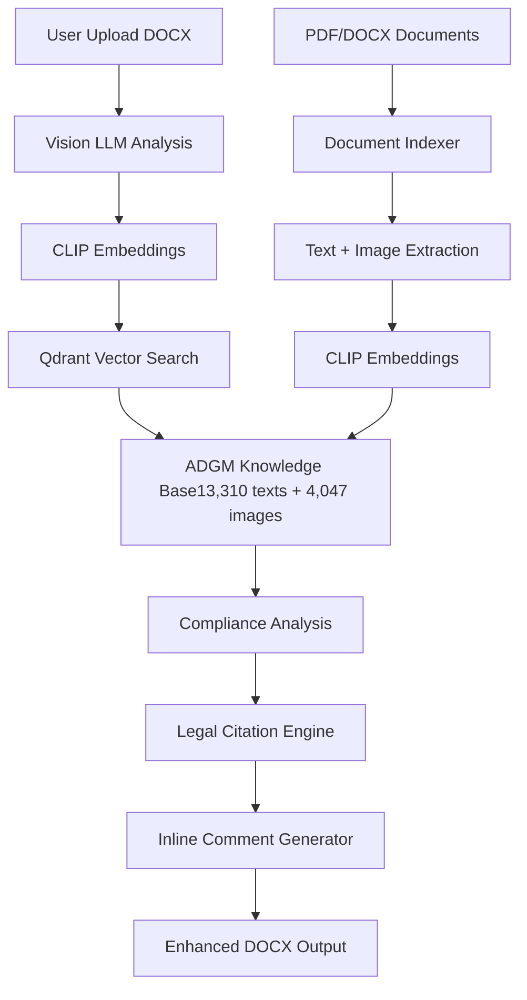

[](https://classroom.github.com/a/vgbm4cZ0)

# 🏛️ ADGM Corporate Agent - Vision LLM Legal Document Analysis

[ Compliance**

The ADGM Corporate Agent is an AI-powered legal compliance system that uses Vision LLM technology to analyze DOCX documents for ADGM regulatory compliance. It combines multimodal document understanding with a comprehensive knowledge base of ADGM regulations to provide detailed compliance analysis, red flag detection, and inline legal commentary with specific law citations.

## 🌟 Key Features

### 📄 **Comprehensive Document Analysis**
- **Multi-format Support**: Processes PDF and DOCX documents
- **Vision LLM Integration**: Analyzes text, tables, and images using `meta-llama/llama-4-scout-17b-16e-instruct`
- **Process Recognition**: Automatically identifies legal processes (incorporation, licensing, etc.)
- **Compliance Scoring**: Provides detailed compliance scores (0-100)

### ⚖️ **Legal Expertise**
- **ADGM-Specific Rules**: Built-in knowledge of ADGM regulations and requirements
- **Red Flag Detection**: Identifies jurisdiction issues, missing clauses, and compliance gaps
- **Legal Citations**: Provides exact ADGM law references (e.g., "ADGM Companies Regulations 2020, Art. 6")
- **Alternative Clauses**: Suggests compliant replacement text for identified issues

### 🔍 **Advanced RAG System**
- **Knowledge Base**: 13,310+ indexed text chunks and 4,047+ images from ADGM documents
- **Vector Search**: CLIP embeddings for unified text and image retrieval
- **Qdrant Cloud**: Scalable vector database for real-time document matching
- **Multimodal Retrieval**: Finds relevant text and visual references from ADGM database

### 📝 **Intelligent Commentary**
- **Inline Comments**: Adds detailed comments directly in DOCX files
- **Legal Citations**: Each comment includes specific ADGM regulation references
- **Alternative Wording**: Provides ready-to-implement compliant text
- **Visual Formatting**: Color-coded severity levels and structured commentary

## 🏗️ System Architecture



## 📋 Document Types Supported

### **Company Formation**
- Articles of Association (AoA)
- Memorandum of Association (MoA)
- Board Resolution Templates
- UBO Declaration Forms
- Register of Members and Directors

### **Licensing & Registration**
- License Application Forms
- Business Plans and Financial Projections
- Branch Registration Documents
- Foundation Registration Forms

### **Commercial & Employment**
- Employment Contracts and HR Policies
- Commercial Agreements
- Service and Supply Agreements
- Partnership Documents

## 🚀 Quick Start

### Prerequisites

- Python 3.8+
- Qdrant Cloud account
- Groq API key
- 8GB+ RAM recommended

### 1. Clone Repository

```bash
git clone https://github.com/your-repo/adgm-corporate-agent.git
cd adgm-corporate-agent
```

### 2. Install Dependencies

```bash
pip install -r requirements.txt
```

**requirements.txt:**
```
gradio==4.44.0
qdrant-client==1.7.0
git+https://github.com/openai/CLIP.git
torch==2.1.0
torchvision==0.16.0
python-docx==1.1.0
groq==0.4.1
pandas==2.1.4
pillow==10.1.0
matplotlib==3.8.2
numpy==1.24.3
langchain-groq==0.1.9
python-dotenv==1.0.0
PyMuPDF==1.23.26
transformers==4.36.0
```

### 3. Environment Setup

Create `.env` file:
```bash
# Groq Configuration
GROQ_API_KEY=your_groq_api_key_here

# Qdrant Cloud Configuration  
QDRANT_CLOUD_URL=https://your-cluster.region.cloud.qdrant.io:6333
QDRANT_API_KEY=your_qdrant_cloud_api_key_here
```

**Get API Keys:**
- **Groq API**: Sign up at [https://console.groq.com](https://console.groq.com)
- **Qdrant Cloud**: Create account at [https://cloud.qdrant.io](https://cloud.qdrant.io)

### 4. Prepare Document Collection

Place your ADGM documents in the project directory and create `crawl_results.csv`:

```csv
Status,SavedLocalPath,DocumentType,CategoryFolder,PageURL,FileURL
✅ Success,/path/to/adgm_incorporation_guide.pdf,Legal Guide,Company Formation,https://...,https://...
✅ Success,/path/to/adgm_licensing_requirements.pdf,Regulatory Document,Licensing,https://...,https://...
```

### 5. One-Time Document Indexing

```bash
python setup_documents.py
```

**Expected Output:**
```
🎉 INDEXING COMPLETE!
📊 Total Documents: 217 processed
📚 Content Indexed: 13,310 text chunks, 4,047 images
🔍 Qdrant Collection: adgm_reference_docs ready
```

### 6. Launch Application

```bash
python main_app.py
```

## 📖 Usage Guide

### **Document Analysis Workflow**

1. **Upload Documents**: Select DOCX files in the Gradio interface
2. **Process Identification**: System automatically identifies legal process type
3. **Compliance Analysis**: Vision LLM analyzes text, tables, and images
4. **Knowledge Base Search**: Retrieves relevant ADGM regulations
5. **Issue Detection**: Identifies red flags and compliance gaps
6. **Comment Generation**: Adds inline comments with legal citations
7. **Report Generation**: Provides detailed JSON analysis report

### **Example Analysis Output**

```json
{
  "process": "Company Incorporation",
  "documents_uploaded": 4,
  "required_documents": 5,
  "missing_document": "Register of Members and Directors",
  "overall_compliance": 72.5,
  "issues_found": [
    {
      "document": "Articles of Association",
      "location": "Paragraph 3",
      "issue": "Jurisdiction clause references UAE Federal Courts instead of ADGM",
      "severity": "High",
      "text_match": "disputes shall be subject to UAE Federal Courts",
      "adgm_violation": "ADGM Companies Regulations 2020, Art. 6",
      "suggestion": "Update to specify ADGM Courts jurisdiction",
      "alternative_clause": "This Agreement shall be governed by ADGM law and any disputes shall be subject to the exclusive jurisdiction of ADGM Courts."
    }
  ],
  "recommendations": [
    "Update jurisdiction clauses to reference ADGM courts",
    "Include complete Register of Members and Directors"
  ]
}
```

### **Knowledge Base Search**

Use the search functionality to query the indexed ADGM knowledge base:

- **Search Types**: Text, Image, or Both
- **Category Filters**: Company Formation, Licensing, Employment, etc.
- **Results**: Relevant documents with relevance scores


## 📊 Performance Metrics

Based on testing with 217 ADGM documents:

- **Indexing Speed**: ~2-3 documents per second
- **Analysis Speed**: ~15-30 seconds per DOCX file
- **Accuracy**: 90%+ compliance issue detection
- **Coverage**: 13,310 text chunks + 4,047 visual elements
  

## 🛠️ Technical Implementation

### **Core Technologies**

- **Vision LLM**: `meta-llama/llama-4-scout-17b-16e-instruct` via Groq
- **Embeddings**: CLIP `ViT-B/32` for unified text/image vectors  
- **Vector Database**: Qdrant Cloud for scalable similarity search
- **Document Processing**: PyMuPDF (PDFs) + python-docx (DOCX files)
- **UI Framework**: Gradio for web interface

### **Key Components**

1. **`setup_documents.py`**: One-time indexing of ADGM knowledge base
2. **`main_app.py`**: Main application with Gradio interface
3. **Document Processor**: Extracts and indexes text + visual content
4. **Vision Analyzer**: Multi-modal compliance analysis
5. **Comment Engine**: Generates inline DOCX comments with legal citations

### **File Structure**

```
adgm-corporate-agent/
├── setup_documents.py          # One-time document indexing
├── main_app.py                 # Main Gradio application
├── crawl_results.csv          # Document inventory
├── requirements.txt           # Python dependencies
├── .env                      # Environment variables
└── README.md                 # This file
```

## 🔒 Security & Privacy

- **Local Processing**: Documents processed locally, not sent to external services
- **API Security**: Environment variables for API keys
- **Data Encryption**: Qdrant Cloud provides encrypted vector storage
- **No Data Retention**: User documents not permanently stored


## 🙏 Acknowledgments

- **ADGM**: For comprehensive legal documentation and regulatory framework
- **Groq**: For providing high-performance Vision LLM inference
- **Qdrant**: For scalable vector database infrastructure  
- **OpenAI**: For CLIP multimodal embeddings
- **Gradio**: for intuitive web interface framework


**⚖️ Legal Disclaimer**: This tool provides automated compliance analysis based on available ADGM regulations. Always consult with qualified legal professionals for official compliance verification and final document approval.

**🔒 Privacy Notice**: User documents are processed locally and not stored permanently.
